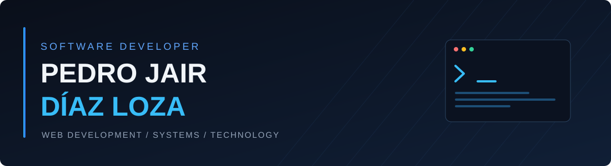

 

### Desarrollador Web | Ingeniería de Sistemas

**React · TypeScript · JavaScript · Python · Java · Supabase**

Desarrollo aplicaciones web, landing pages y sistemas digitales con un enfoque en el diseño, la funcionalidad y la experiencia de usuario.

---

## Sobre mí

Soy **Pedro Jair Díaz Loza**, estudiante de Ingeniería de Sistemas en la Universidad Privada San Juan Bautista, Perú.

Me interesa el desarrollo de software y la creación de soluciones digitales que combinen una buena experiencia de usuario con una estructura técnica sólida.

Tengo conocimientos en desarrollo frontend, programación, bases de datos y herramientas para construir aplicaciones modernas.

Actualmente me enfoco en mejorar mis habilidades en desarrollo web, arquitectura de software e integración de servicios.

---

## Tecnologías y herramientas

### Desarrollo Frontend

  

### Programación y bases de datos

  

### Herramientas de desarrollo

  

---

## Áreas de desarrollo

| Área | Conocimientos |
| :--- | :--- |
| **Desarrollo Web** | Creación de sitios y aplicaciones web modernas |
| **Landing Pages** | Diseño de páginas responsivas para negocios y servicios |
| **Frontend** | Interfaces con React, TypeScript, JavaScript, HTML y CSS |
| **Sistemas Web** | Desarrollo de paneles administrativos y sistemas de gestión |
| **Bases de Datos** | Integración de Supabase y gestión de información |
| **Programación** | Desarrollo de soluciones con Python y Java |
| **Desarrollo Android** | Conocimientos de Android Studio |
| **Control de Versiones** | Gestión de código mediante Git y GitHub |

---

## Enfoque de desarrollo

Me interesa trabajar en proyectos que involucren:

- Desarrollo de aplicaciones web responsivas y escalables.
- Creación de interfaces modernas y componentes reutilizables.
- Diseño de landing pages para empresas y emprendimientos.
- Desarrollo de sistemas de gestión y paneles administrativos.
- Integración de autenticación, bases de datos y servicios backend.
- Organización del código y buenas prácticas de desarrollo.
- Optimización de interfaces y experiencia de usuario.

---

## Estadísticas de GitHub

> Las estadísticas dependen de servicios externos y pueden tardar en cargar.

---

## Actualmente aprendiendo

- Desarrollo avanzado con React y TypeScript.
- Arquitectura de aplicaciones web.
- Integración de bases de datos y servicios backend.
- Diseño de componentes reutilizables.
- Buenas prácticas de programación.
- Desarrollo de sistemas web completos.

---

## Contacto

Estoy interesado en seguir aprendiendo, desarrollar proyectos y colaborar en soluciones tecnológicas.

---

Pedro Jair Díaz Loza | Desarrollo Web y Soluciones Digitales

  
